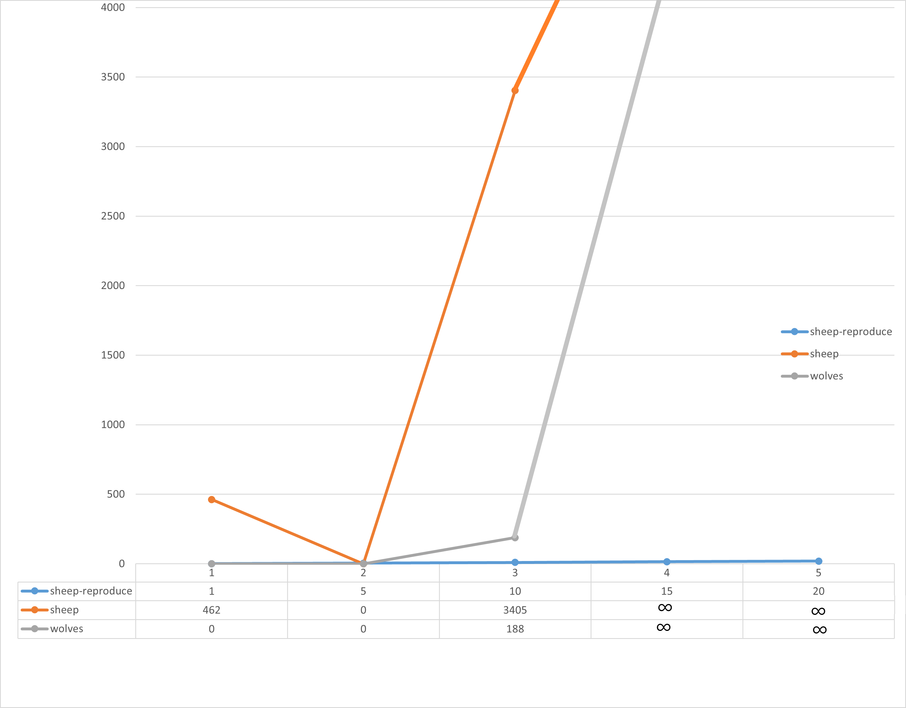
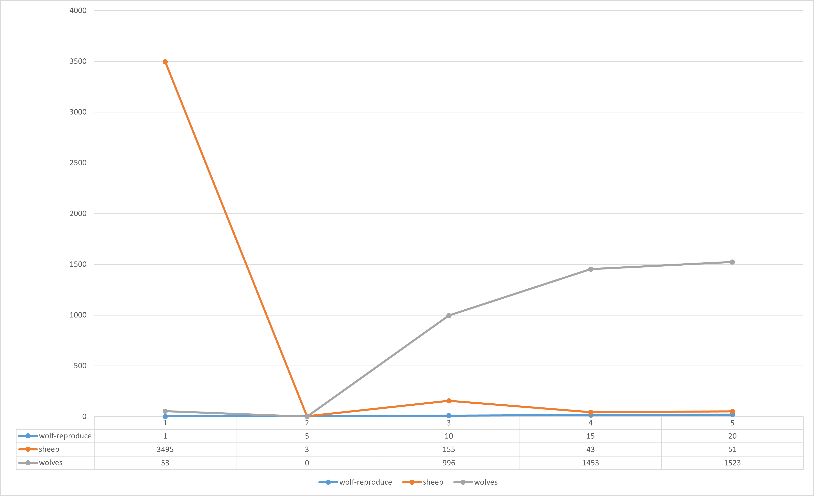
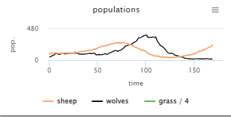
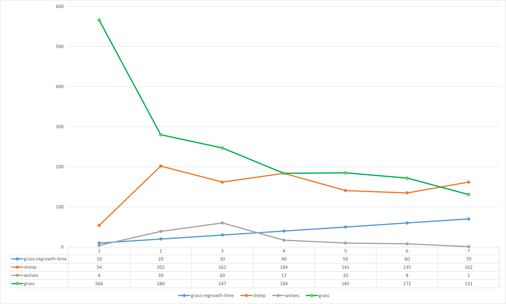

## Комп'ютерні системи імітаційного моделювання

## СПм-23-4, Дубихвіст Вадим Вячеславович

### Лабораторна робота №**1**. Опис імітаційних моделей та проведення обчислювальних експериментів

 

### Варіант 7, Wolf Sheep Predation. Модель взаємоіснування хижаків та їх жертв. Модель у середовищі NetLogo:

[Wolf Sheep Predation](http://www.netlogoweb.org/launch#http://www.netlogoweb.org/assets/modelslib/Sample%20Models/Biology/Wolf%20Sheep%20Predation.nlogo)

 

## Вербальний опис моделі:

Ця модель аналізує стабільність екосистеми «хижак-жертва». Система вважається нестабільною, якщо в ній відбувається вимирання одного або кількох видів. Натомість стабільна система здатна зберігати рівновагу протягом тривалого часу, незважаючи на коливання чисельності популяцій.

### Основні варіанти моделі:

У першому варіанті, «вівці-вовки», вовки і вівці хаотично пересуваються по території. Вовки шукають овець для полювання, оскільки кожен їхній крок витрачає енергію. Щоб вижити, вовки повинні харчуватися, інакше вони помирають від виснаження. Для збереження популяцій кожен вовк і вівця мають певну ймовірність розмноження на кожному етапі часу. У цьому варіанті трава вважається «нескінченною», тобто вівці завжди мають достатньо їжі, і поїдання або вирощування трави не моделюється. В результаті вівці не втрачають і не отримують енергії через їжу чи рух. Така модель демонструє цікаву динаміку, але зрештою є нестабільною. Цей варіант добре підходить для аналізу взаємодії видів у середовищах із достатньою кількістю ресурсів, як-от бактеріальні культури у чашці Петрі.

Другий варіант, «вівці-вовки-трава», додає до моделі траву (зелену), яку вівці мають їсти для підтримання енергії. Якщо вівці залишаються без їжі, вони гинуть. Трава відростає лише після певного часу після з’їдання. Поведінка вовків залишається такою ж, як у першому варіанті. Ця модель складніша, але загалом є стабільнішою, ближчою до класичних моделей Лотки–Вольтерра. Однак класичні моделі LV передбачають реальні значення популяцій, що може призводити до недооцінки ризику вимирання у невеликих популяціях. Моделі на основі агентів, як у цьому випадку, дають реалістичніші результати.

### Керуючі параметри:

- **model-version** - вибір варіанта моделі.
- **initial-number-sheep** - початкова кількість овець.
- **initial-number-wolves** - початкова кількість вовків.
- **grass-regrowth-time** - час, необхідний для відновлення трави після з’їдання.
- **sheep-gain-from-food** - кількість енергії, яку вівці отримують, з’ївши траву.
- **wolf-gain-from-food** - кількість енергії, яку вовки отримують, з’ївши вівцю.
- **sheep-reproduce** - ймовірність розмноження вівці на кожному етапі.
- **wolf-reproduce** - ймовірність розмноження вовка на кожному етапі.

### Параметри візуалізації:

- **show-energy** - чи показувати енергію кожної тварини у вигляді чисел?

### Показники роботи системи:

- **sheep** - поточна чисельність овець.
- **wolves** - поточна чисельність вовків.
- **grass** - поточна кількість трави.
- **populations** - графік, що демонструє динаміку параметрів **sheep**, **wolves** та **grass**.

### Недоліки моделі:

- Відсутність у вовків поведінки, що передбачає оточення стада, як у реальному житті.
- Випадковий рух овець без спроб уникати вовків.

### Примітки:

- У стандартних умовах вовки зазвичай з’їдають більшість овець, після чого гинуть від голоду. Залишені без хижаків, вівці неконтрольовано розмножуються і зрештою захоплюють світ, що супроводжується відповідним повідомленням.
- Модель вимагає значних обчислювальних ресурсів під час роботи.

 

## Обчислювальні експерименти

### 1. Вплив розмножуваності овець на показники системи

Досліджується залежність **sheep** та **wolves** від **sheep-reproduce** протягом певної кількості тактів (200).
Усього 5 симуляцій. Керуючі параметри мають такі значення:

- **model-version** - sheep-wolves
- **initial-number-sheep** - 100
- **initial-number-wolves** - 50
- **grass-regrowth-time** - 0
- **sheep-gain-from-food** - 0
- **wolf-gain-from-food** - 20
- **wolf-reproduce** - 5

<table>
<thead>
<tr><th>sheep-reproduce</th><th>sheep</th><th>wolves</th></tr>
</thead>
<tbody>
<tr><td>1</td><td>462</td><td>0</td></tr>
<tr><td>5</td><td>0</td><td>0</td></tr>
<tr><td>10</td><td>3405</td><td>188</td></tr>
<tr><td>15</td><td>∞</td><td>∞</td></tr>
<tr><td>20</td><td>∞</td><td>∞</td></tr>
</tbody>
</table>

Під час проводження експерименту при **sheep-reproduce** >10 жоден з агентів так і не зник з робочого простору симуляції. Окрім того навантаження на систему було надпотужне.

 

### 2. Вплив розмножуваності вовків на показники системи

Досліджується залежність **sheep** та **wolves** від **wolf-reproduce** протягом певної кількості тактів (200).
Усього 5 симуляцій. Керуючі параметри мають такі значення:

- **model-version** - sheep-wolves
- **initial-number-sheep** - 100
- **initial-number-wolves** - 50
- **grass-regrowth-time** - 0
- **sheep-gain-from-food** - 0
- **wolf-gain-from-food** - 20
- **sheep-reproduce** - 5

<table>
<thead>
<tr><th>sheep-reproduce</th><th>sheep</th><th>wolves</th></tr>
</thead>
<tbody>
<tr><td>1</td><td>3495</td><td>53</td></tr>
<tr><td>5</td><td>3</td><td>0</td></tr>
<tr><td>10</td><td>15</td><td>996</td></tr>
<tr><td>15</td><td>43</td><td>1453</td></tr>
<tr><td>20</td><td>51</td><td>1523</td></tr>
</tbody>
</table>

Під час цього експерименту було помічено дуже різні результати, але якщо підвести підсумки, то при **wolf-reproduce** <10 вовки з'їдаючи забагато овець не встигали давати нащадок та вимирали. Але при підвищенні шансу не було помічено вимирання будь-якого типу агентів, але графік почав виглядати таким чином:

 

### 3. Вплив швидкості вирастання трави на показники системи

Досліджується залежність **sheep**, **wolves** та **grass** від **grass-regrowth-time** протягом певної кількості тактів (200).
Усього 5 симуляцій. Керуючі параметри мають такі значення:

- **model-version** - sheep-wolves
- **initial-number-sheep** - 100
- **initial-number-wolves** - 50
- **sheep-gain-from-food** - 4
- **wolf-gain-from-food** - 20
- **sheep-reproduce** - 4
- **wolf-reproduce** - 5

<table>
<thead>
<tr><th>grass-regrowth-time</th><th>sheep</th><th>wolves</th><th>grass</th></tr>
</thead>
<tbody>
<tr><td>10</td><td>54</td><td>4</td><td>566</td></tr>
<tr><td>20</td><td>202</td><td>39</td><td>280</td></tr>
<tr><td>30</td><td>162</td><td>60</td><td>247</td></tr>
<tr><td>40</td><td>184</td><td>17</td><td>184</td></tr>
<tr><td>50</td><td>141</td><td>10</td><td>185</td></tr>
<tr><td>60</td><td>135</td><td>8</td><td>172</td></tr>
<tr><td>70</td><td>162</td><td>1</td><td>131</td></tr>
</tbody>
</table>

Під час проведення експерименту було відзначено, що будь-яке значення **grass-regrowth-time**, окрім 0, не має значного впливу на процес симуляції, щоб це можна було помітити.
